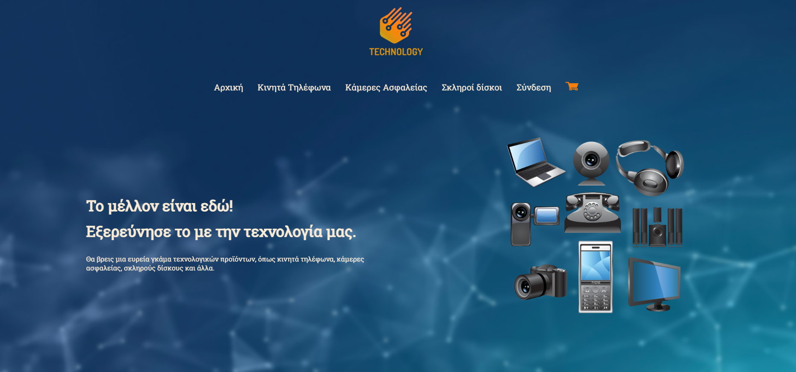

# eShop Web Application

## 📦 Description

This is a full-stack eCommerce web application developed as part of a final-year university project. The application allows users to register, log in, browse product categories, manage their shopping cart, and place orders. Although payment integration is not implemented, users receive a PDF receipt via email after completing a purchase.

---

## 🛠️ Technologies Used

- **Frontend:** HTML, CSS, JavaScript
- **Backend:** Node.js, Express.js
- **Database:** MongoDB (with MongoDB Compass for local management)
- **File Handling:** Excel (for dynamic product loading)
- **PDF Generation & Email:** PDFKit / Nodemailer (or similar)

---

## 🚀 Features

- User registration and login (data stored in MongoDB)
- Product categories: Mobile Phones, Security Cameras, Hard Drives
- Dynamic product loading from an Excel file
- Fully functional shopping cart:
  - Add products
  - Update quantities
  - Remove items
- Order form submission
- Email confirmation with downloadable PDF receipt (invoice)
- Clean and responsive UI

---

## 📸 Screenshots

### 🏠 Home Page  

### 📱 Phones Page  

### 🛒 Cart & Checkout  

View more screenshots in the [`screenshots/`](./screenshots) folder.

---

## 📩 Email + PDF Workflow

- Upon order submission:
  - A PDF invoice is generated using **PDFKit**
  - The invoice is attached to an email using **Nodemailer**
  - The user receives a confirmation email with the invoice

---

## 📝 Developer's Note

This was my first experience with web development, having previously worked mainly with C++. As a result, the project structure may not follow best practices or clean architecture standards. However, the focus of this project was to explore the full development cycle of a web application — from backend and frontend logic to database integration and dynamic content loading — and to demonstrate functional features such as authentication, cart management, and email-based PDF invoicing.

Going forward, I'm committed to improving my code organization, implementing design patterns, and following industry-standard development practices.

